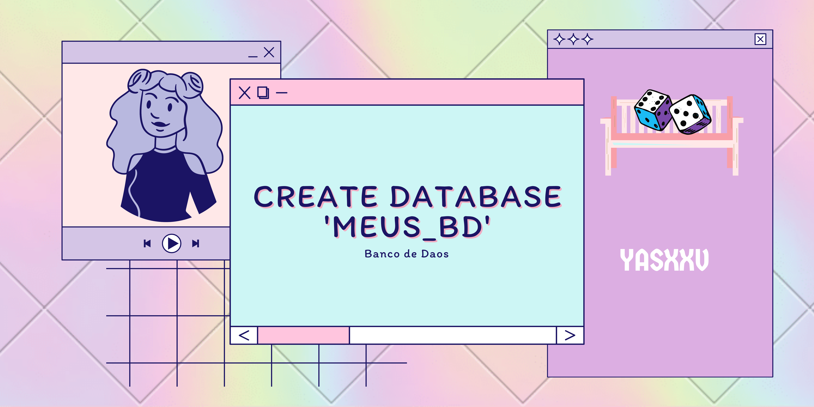

> 🪑 Alguns Bancos de dados que criei

## ✏️ Sobre o projeto

Este repositorio eu reservei para deixar guardado os bancos de dados que criei.

## 🎲 Bancos de dados

### • <a href="https://github.com/yasxxv/phpMyAdmin-SQL-Dump/blob/main/pokemon.sql">pokemon</a>

Esse foi o meu primeiro banco de dados criado.

### • <a href="https://github.com/yasxxv/phpMyAdmin-SQL-Dump/blob/main/bd_equipe1.sql">bd_equipe1</a>

Seria um banco de dados de uma escola com os alunos, contatos dos alunos, materias e os preços dos livros para comprar com desconto ou sem desconto.

### • <a href="https://github.com/yasxxv/phpMyAdmin-SQL-Dump/blob/main/cadastro_do_psic__logo.sql">cadastro_do_psic__logo</a>

No instituto PROA fiz parte do projeto em grupo para ajudar mulheres que sofrem ou sofreram violência doméstica a denunciar o agressor, esse seria o banco de dados para a psicóloga atender as vítimas.

---------------------------

Feito com :hearts: por <a href="https://github.com/yasxxv">yasxxv</a>
